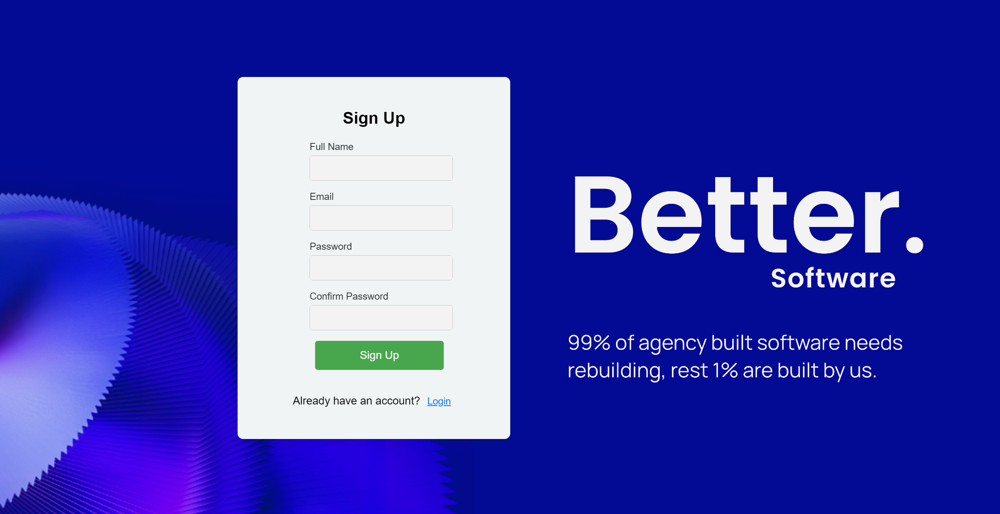

To run the project clone down this repository. You will need node and npm installed on your machine.
Installation:
npm install

Start Server:
npm start

The design choices made
1-Clear Form Structure.
2-Mobile Responsiveness.
3-Background Image with Overlay.
4-Error Message Styling in Red.
5-Use of Box Shadows and Border Radius to create a subtle elevation effect.
